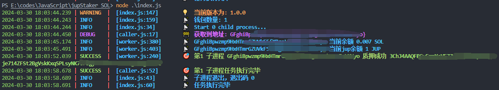
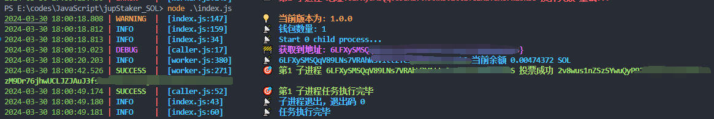
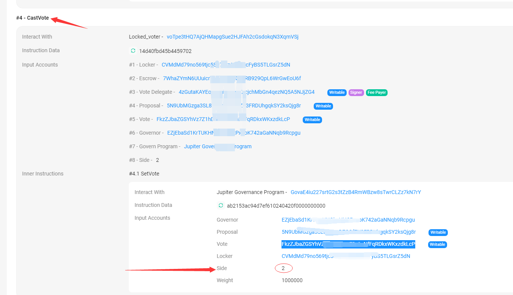

# jup_staker

jup_staker 是一个专为 Solana 链上的 Jupiter 质押和投票设计的批量脚本。通过简化的命令行界面，用户可以轻松进行批量质押和投票操作。
网站 https://vote.jup.ag/

## 运行截图

质押操作

投票操作


## 安装

在项目根目录下，执行以下命令来安装项目依赖：

```bash
npm i
```

首先，您需要在 keys.txt 文件中输入相关的信息。请确保按照下面的格式添加您的信息（例如，地址、私钥等），一行一个：

```bash
地址----私钥
私钥
```

## 运行

然后，运行以下命令来启动程序：

```bash
node index.js
```

## 说明

单账号单个进程同时运行

### 修改投票目标

若需对投票目标进行修改，请按照以下步骤操作：

1. 打开 `src/worker.js` 文件。
2. 定位到文件中的第 43 至 48 行。
3. 根据您的需求，修改以下代码段中的 `proposalId` 和 `voteId` 值：

```javascript
// 示例投票链接：https://vote.jup.ag/proposal/5N9UbMGzga3SL8Rq7qDZCGfZX3FRDUhgqkSY2ksQjg8r
// 修改 `proposalId` 为您想要投票的提案 ID
const proposalId = new PublicKey(
  "5N9UbMGzga3SL8Rq7qDZCGfZX3FRDUhgqkSY2ksQjg8r"
);
const voteId = 2; // 根据实际情况修改 voteId
```

例如，如果您希望投票给链接为 https://vote.jup.ag/proposal/5N9UbMGzga3SL8Rq7qDZCGfZX3FRDUhgqkSY2ksQjg8r 的提案，则将 `proposalId` 的值更改为 `5N9UbMGzga3SL8Rq7qDZCGfZX3FRDUhgqkSY2ksQjg8r`。

比如投票链接为 https://vote.jup.ag/proposal/5N9UbMGzga3SL8Rq7qDZCGfZX3FRDUhgqkSY2ksQjg8r
就把 proposalId 的 内容改成 5N9UbMGzga3SL8Rq7qDZCGfZX3FRDUhgqkSY2ksQjg8r

### 查找投票 ID

要查找特定投票的 `voteId`：

1. 手动进行一次投票。
2. 在区块浏览器中打开您的交易记录。
3. 在 `CastVote` 交易详情中找到 `Side` 字段，其值即为所需的 `voteId`。


